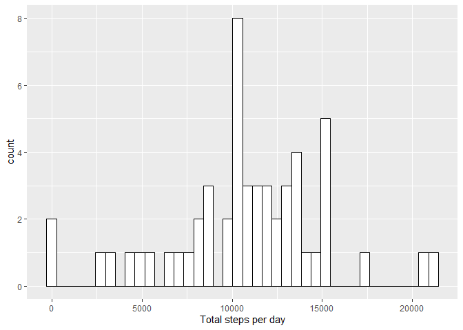
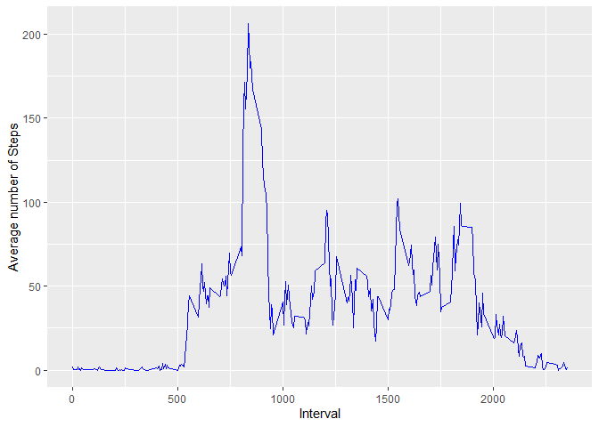
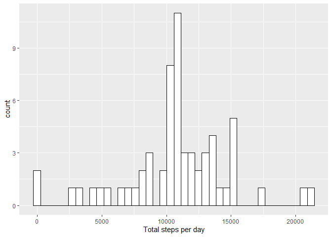
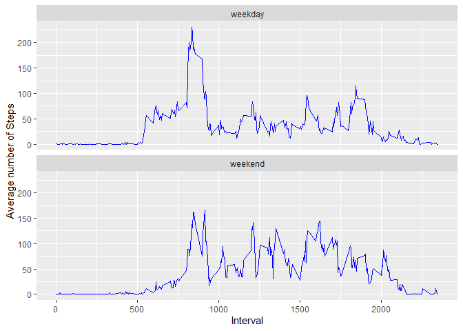

## Loading and preprocessing the data

### First, load the data into R

```r
activity <- as.character(unzip("activity.zip", list = TRUE)$Name)
activityData <- read.csv(unz("activity.zip", "activity.csv"), header = TRUE)
activityData <- activityData[, c(2, 3, 1)]  # re-order the columns
```

### Load required libraries

```r
library(tidyverse)
```

```
## -- Attaching packages --------------------------------------------------------------------------- tidyverse 1.3.0 --
```

```
## v ggplot2 3.3.0     v purrr   0.3.3
## v tibble  3.0.0     v dplyr   0.8.5
## v tidyr   1.0.2     v stringr 1.4.0
## v readr   1.3.1     v forcats 0.5.0
```

```
## -- Conflicts ------------------------------------------------------------------------------ tidyverse_conflicts() --
## x dplyr::filter() masks stats::filter()
## x dplyr::lag()    masks stats::lag()
```


## What is mean total number of steps taken per day?

### Calculate the total number of steps per day 

```r
totalSteps <- activityData %>% 
  group_by(date) %>% 
  summarise(totalSteps = sum(steps))
str(totalSteps)
```

```
## tibble [61 x 2] (S3: tbl_df/tbl/data.frame)
##  $ date      : Factor w/ 61 levels "2012-10-01","2012-10-02",..: 1 2 3 4 5 6 7 8 9 10 ...
##  $ totalSteps: int [1:61] NA 126 11352 12116 13294 15420 11015 NA 12811 9900 ...
```

### Histogram of the total number of steps taken per day

```r
ggplot(data = totalSteps, aes(x = totalSteps)) +
  geom_histogram(bins = 40, color = "black", fill = "white") +
  xlab("Total steps per day")
```

```
## Warning: Removed 8 rows containing non-finite values (stat_bin).
```

<!-- -->

### Calculate the mean and median of the total number of steps taken per day

```r
data.frame(mean = mean(totalSteps$totalSteps, na.rm = TRUE),
           median = median(totalSteps$totalSteps, na.rm = TRUE))
```

```
##       mean median
## 1 10766.19  10765
```

## What is the average daily activity pattern?

### Make a time series plot of the 5-minute interval (x-axis) and the average number of steps taken, averaged across all days (y-axis)

```r
avgStepsPerInterval <- activityData %>% 
  group_by(interval) %>% 
  summarise(avgSteps = mean(steps, na.rm = TRUE))
ggplot(data = avgStepsPerInterval, aes(x = interval, y = avgSteps)) +
        geom_line(color = "blue") +
        ylab("Average number of Steps") +
        xlab("Interval")
```

<!-- -->

### Which 5-minute interval, on average across all the days in the dataset, contains the maximum number of steps?

```r
int <- avgStepsPerInterval %>% filter(avgSteps == max(avgStepsPerInterval$avgSteps))
```

The 835 - interval, on average across all the days in the dataset, contains the maximum number of steps 

## Imputing missing values

### Calculate the total number of missing values in the dataset (i.e. the total number of rows with NAs)

```r
rowsNA <- sum(is.na(activityData$steps))
```

There are 2304 missing values in the dataset 

### Devise a strategy for filling in all of the missing values in the dataset and create a new dataset that is equal to the original dataset but with the missing data filled in
The missing values in the dataset are replaced with the average number of steps for the respective 5-minute intervals

```r
activityDataWide <- activityData %>% 
        pivot_wider(names_from = date, values_from = steps) 

colsWithNA <- names(which(colSums(is.na(activityDataWide)) > 0))

activityDataNAReplaced <- activityDataWide %>% 
  mutate_at(vars(all_of(colsWithNA)), ~(avgStepsPerInterval$avgSteps)) %>%  # Replace missing values with average steps per interval
  pivot_longer(-interval, names_to = "date", values_to = "steps") %>% 
  select(date, interval, steps)
```

### Make a histogram of the total number of steps taken each day 

```r
totalStepsNAReplaced <- activityDataNAReplaced %>% 
  group_by(date) %>% 
  summarise(totalSteps = sum(steps))
ggplot(data = totalStepsNAReplaced, aes(x = totalSteps)) +
  geom_histogram(bins = 40, color = "black", fill = "white") +
  xlab("Total steps per day")
```

<!-- -->

### Calculate and report the mean and median total number of steps taken per day

```r
data.frame(mean = mean(totalStepsNAReplaced$totalSteps, na.rm = TRUE),
           median = median(totalStepsNAReplaced$totalSteps, na.rm = TRUE))
```

```
##       mean   median
## 1 10766.19 10766.19
```

### Do the mean and median values differ from the estimates from the first part of the assignment? What is the impact of imputing missing data on the estimates of the total daily number of steps?

```
##                   meanTotalSteps medianTotalSteps
## Before NA Removal       10766.19         10765.00
## After NA Removal        10766.19         10766.19
```

Using the strategy of replacing NA values in the steps data with the average number of steps for the respective intervals, the mean and median estimates of the total daily number of steps are not affected. 

## Are there differences in activity patterns between weekdays and weekends?

### Create a new factor variable in the dataset with two levels – “weekday” and “weekend” indicating whether a given date is a weekday or weekend day

```r
activityDataNAReplaced$date <- as.Date(activityDataNAReplaced$date)
activityDataNAReplaced$day <- as.factor(ifelse(weekdays(activityDataNAReplaced$date) %in% c("Saturday", "Sunday"), "weekend", "weekday"))
```

### Make a panel plot containing a time series plot of the 5-minute interval (x-axis) and the average number of steps taken, averaged across all days (y-axis)

```r
avgStepsPerInterval <- activityDataNAReplaced %>% 
  group_by(interval, day) %>% 
  summarise(avgSteps = mean(steps)) %>% 
  arrange(desc(day))
ggplot(data = avgStepsPerInterval, aes(x = interval, y = avgSteps)) +
        geom_line(color = "blue") +
        labs(y = "Average number of Steps",
             x = "Interval") +
        facet_wrap(~day, nrow = 2) 
```

<!-- -->

The average number of steps are more consistent throughout the day on the weekends, while they peak during a certain interval on the weekdays. 

